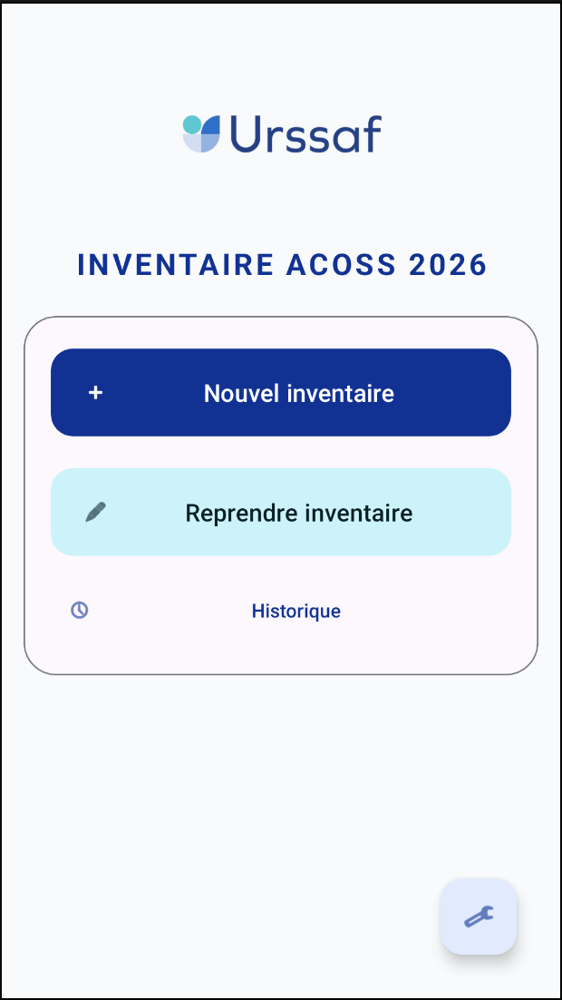
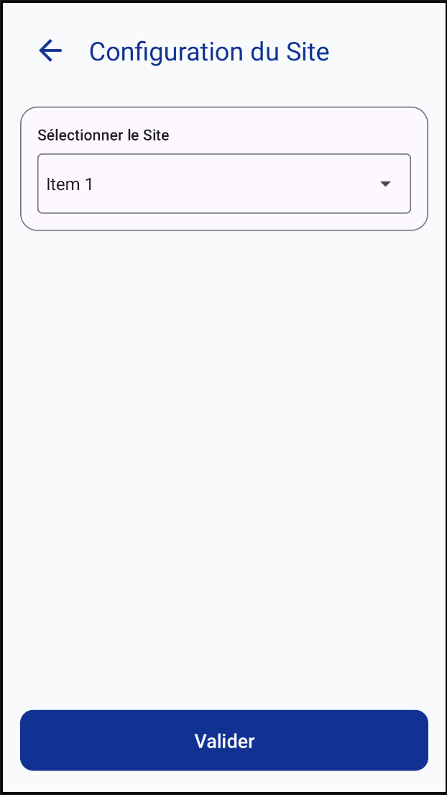
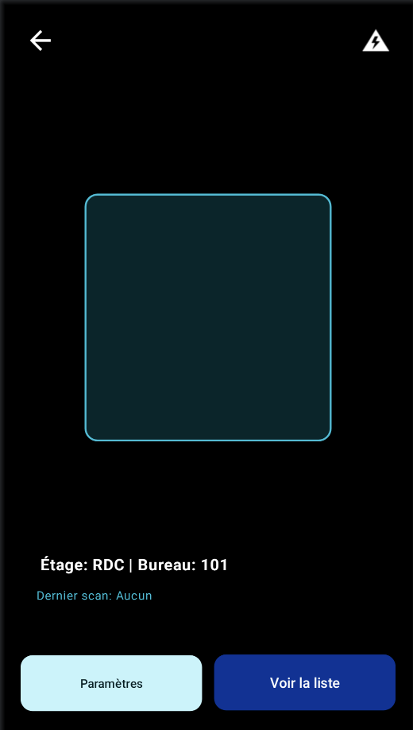
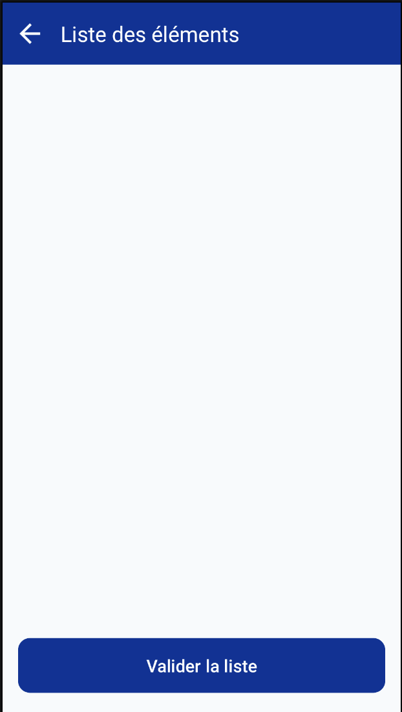
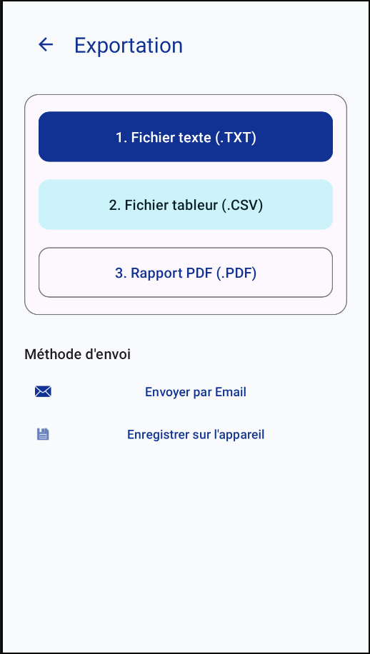
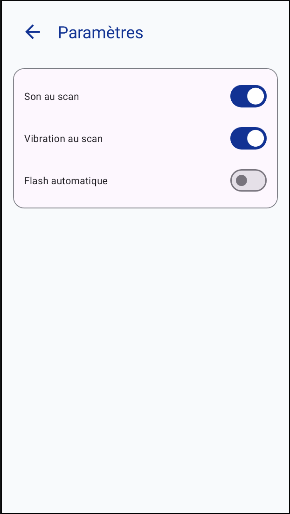

# Application d'inventaire Acoss 2026 📱

Application Android native dédiée à la réalisation d'inventaires physiques pour l'Acoss. Conçue pour être performante, 100% hors-ligne et optimisée pour une utilisation intensive sur le terrain (Samsung Galaxy A54).

---

## Fonctionnalités principales

### 1. Accueil & Configuration
- **Identité Urssaf** : Interface aux couleurs institutionnelles.
- **Gestion de Session** : Sélection rapide du site (ex: Acoss - Marseille).
- **Accès Rapide** : Reprise d'inventaire ou consultation de l'historique.

### 2. Scanner Haute Performance
- **Technologie** : Propulsé par Google ML Kit et CameraX.
- **Multi-formats** : Supporte QR Code, Code 128, Code 39, EAN-13, DataMatrix.
- **Feedback Terrain** : Vibration et bip sonore configurables à chaque scan.
- **Gestion des Zones** : Changement d'étage et de bureau en un clic.
- **Anti-doublon** : Alerte visuelle immédiate (Orange) si un code est scanné deux fois.

### 3. Gestion & Exportation
- **Liste de contrôle** : Visualisation en temps réel des objets scannés.
- **Export Multi-format** :
  - **.CSV** : Optimisé pour Excel France (séparateur `;`).
  - **.TXT** : Format tabulé pour intégration système.
  - **.PDF** : Rapport d'inventaire formel.
- **Modes de transfert** : Envoi direct par Email (Outlook/Gmail) ou sauvegarde locale via SAF (choix du dossier).

---

## Stack Technique

- **Langage** : Kotlin
- **UI** : XML + ViewBinding (Material Design 3)
- **Architecture** : MVVM + Repository Pattern
- **Persistence** : Room Database
- **Scanner** : CameraX + ML Kit Barcode Scanning
- **Asynchronisme** : Kotlin Coroutines
- **Navigation** : Jetpack Navigation Component

---

## Installation

1. Cloner le dépôt.
2. Ouvrir le projet avec **Android Studio**.
3. Effectuer un **Gradle Sync**.
4. S'assurer que le logo `app/src/main/res/drawable/logo_urssaf.png` est présent.
5. Compiler et déployer sur un appareil (Min SDK 26).

---

## Confidentialité & Sécurité
L'application fonctionne à **100% hors-ligne**. Aucune donnée n'est envoyée vers un serveur tiers. Les exports sont gérés localement par l'utilisateur.

---

## Aperçu de l'application

| Accueil | Configuration | Scan |
| :---: | :---: | :---: |
|  |  |  |

| Liste | Export | Paramètres |
| :---: | :---: | :---: |
|  |  |  |

---
*Projet développé pour l'Acoss - 2026*
